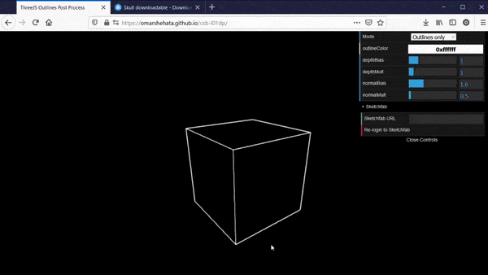

# ThreeJS Sketchfab Code Example

This is a minimal code example for how to load 3D models as glTF from the Sketchfab API into a ThreeJS scene. 

It shows how to authenticate & fetch the model, and how to correctly load a glTF model inside a zip file into ThreeJS.

### Live example

This repo does not contain any live Sketchfab credentials. You can see a version of this in my [WebGL outlines tutorial](https://github.com/OmarShehata/webgl-outlines#live-demo). First, click "Login with Sketchfab", then paste in any Sketchfab URL to load it into the scene.

### How to use

1. Get your Sketchfab token, [see instructions here](https://sketchfab.com/developers/oauth#registering-your-app), you need to contact them.
2. When registering your app, you'll need to pick a redirect URI. This should be the URI where you'll deploy your final app.
3. Insert your token in [SketchfabIntegration.js](https://github.com/OmarShehata/threejs-sketchfab-example/blob/main/SketchfabIntegration.js#L1)
4. Run this app by running `yarn dev`.

You can now go to [localhost:1234](http://localhost:1234) and login with your Sketchfab account. It will redirect you to your redirect URI, but for local testing you can copy the URI and manually open localhost with the access token params.

### Code snippet for loading a ZIP file

If you're here just to see an example for how to load a ZIP file in ThreeJS, see this function here:

https://github.com/OmarShehata/threejs-sketchfab-example/blob/main/SketchfabIntegration.js#L30

It takes a URL to a zip file and a reference to the ThreeJS scene. It needs `jszip` as a dependency. 
